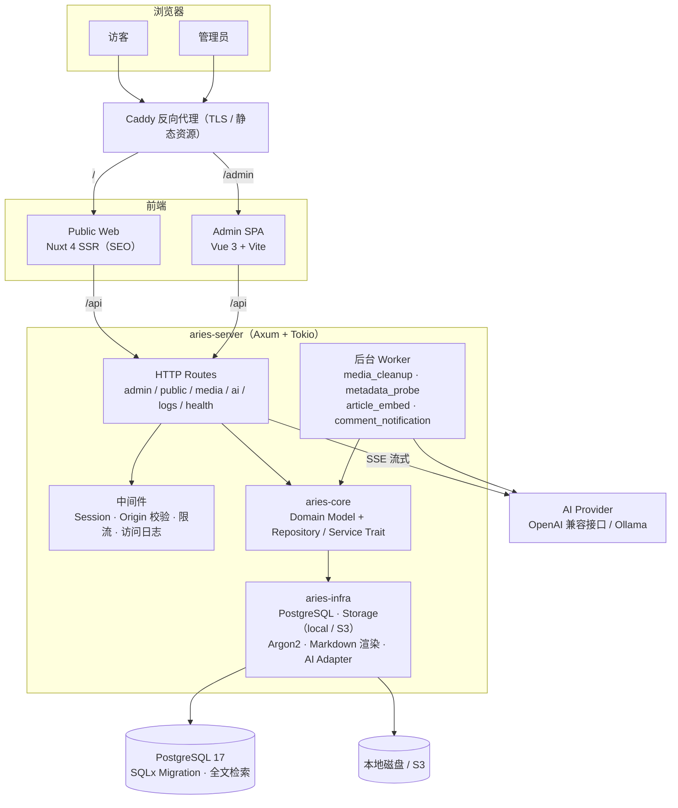
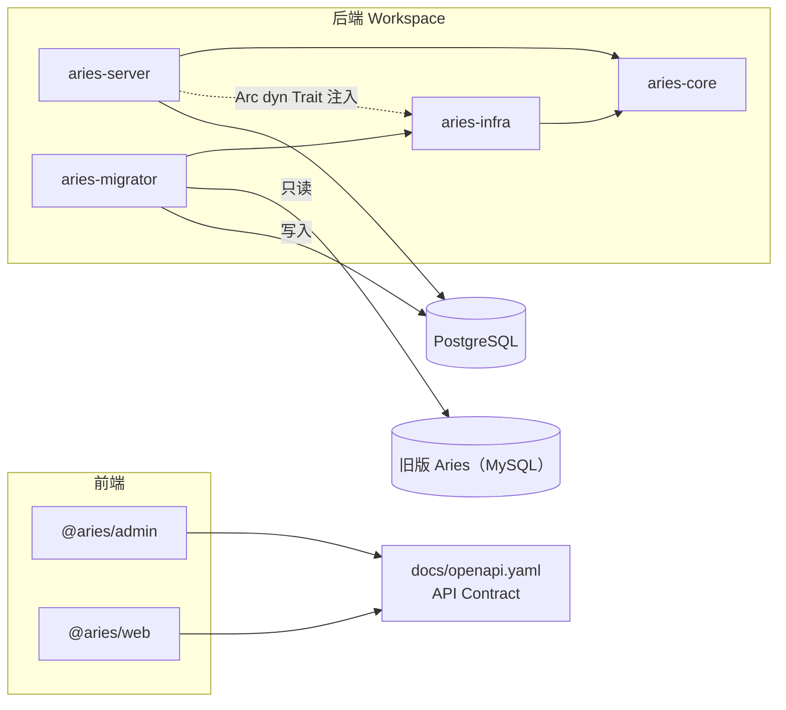
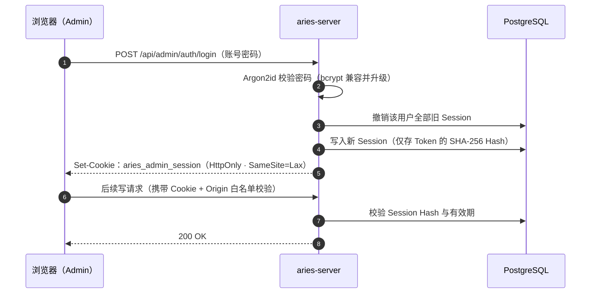
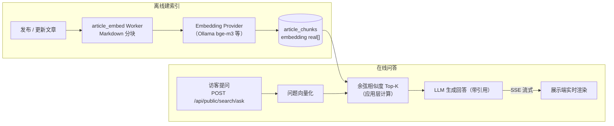
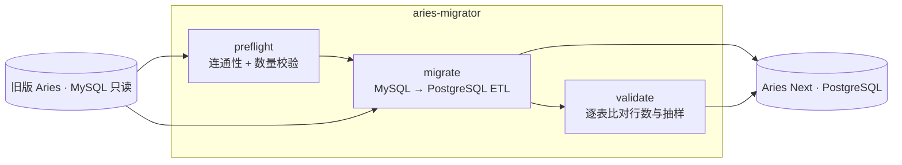

<div align="center">

# Aries Next

**基于 Rust + Vue 3 + Nuxt 4 的现代化博客系统（Modular Monolith）**

<p>
  <a href="https://github.com/zhaoyangkun/aries-next/actions/workflows/ci.yml"></a>
  
  
  
  
  
</p>

</div>

> 最后验证日期：2026-10-02

## 项目介绍

Aries Next 是博客系统 [Aries](https://github.com/zhaoyangkun/aries)（Go + MySQL）的新一代重写实现，采用 **Modular Monolith** 架构：一个 Rust API Process、一个 PostgreSQL Database、一个独立构建的 Vue 3 Admin SPA、一个 Nuxt 4 SSR Public Web。旧版 Aries 在正式切换前保持可运行，作为功能行为、数据迁移和 URL 兼容性的基准。

设计优先级：**数据安全、可回滚迁移、SEO、可测试性、长期可维护性**。

## ✨ 功能特性

### 内容管理

- Markdown 文章：标签 / 分类、置顶、加密（密码访问）、自定义链接、草稿箱与回收站、Markdown 文件导入
- 页面、日志（Journal）、图库（含分类）、友情链接（含分类）、导航菜单：全部后台可配，展示端动态渲染
- 媒体库：本地上传或 S3 存储、在线预览、按需缩略图、图片插入正文

### 评论系统

- 嵌套评论、浏览计数、管理员回复、回收站与审核流程
- 评论邮件通知（SMTP 可配）
- **AI 审核**：新评论先过 AI 垃圾 / 违规判定，再进入人工审核队列

### AI 能力（Provider Adapter，SSE 流式输出）

- **编辑器助手**：续写、润色、摘要、翻译，流式返回
- **标签推荐**与**AI 导读**：发布文章时一键生成标签和摘要简介
- **AI 检索问答（RAG，可选开关，默认关闭）**：访客在搜索页直接对全站文章提问，答案带引用来源；Embedding 支持 Ollama 等 OpenAI 兼容接口（如 `bge-m3`），可完全本地免费运行

### 站点与系统

- 分组设置（外观 / 邮件 / 集成 / AI）、站点信息、SEO 友好的 SSR 公开站
- 运行日志查询：SQL 日志开关、运行时日志级别覆盖、慢查询 / 慢请求阈值、ERROR 尖峰告警、SSE 实时 tail
- 审计日志、Dashboard、健康检查（`/api/health/live`、`/api/health/ready`）

## 🏗️ 系统架构



模块依赖方向严格遵守：**`aries-server` 与 `aries-infra` 都只依赖 `aries-core` 定义的抽象**（Domain Model 与 Trait），具体实现在运行期通过 `Arc<dyn Trait>` 注入 `AppState`。



## 🔐 认证与会话流程

密码使用 Argon2id 哈希（兼容旧版 bcrypt 并在首次登录后自动升级）；Session Token 只存 SHA-256 Hash，浏览器通过 HttpOnly Cookie 持有；登录先撤销旧 Session 再签发新 Session，防止 Session Fixation。



## 🤖 AI 检索（RAG）流程

文章发布后由后台 Worker 自动分块并生成 Embedding（应用层余弦相似度检索，**无需 pgvector 扩展**）；访客提问时检索相关段落，交给 LLM 生成带引用的回答，SSE 流式输出。



## 🛠️ 技术栈

| 层次 | 技术 |
|------|------|
| Backend | Rust（edition 2024，最低 1.85）、Axum 0.8、Tokio、SQLx 0.8、Tower |
| Database | PostgreSQL 17（或兼容版本），SQLx Migration 管理 Schema，内置全文检索 |
| Admin | Vue 3、TypeScript、Vite、vue-router 5（文件路由）、Pinia 4、Tailwind CSS 4、shadcn-vue、Reka UI |
| Public Web | Nuxt 4（4.5.1）、Vue 3、SSR、Tailwind CSS 4 |
| AI | Provider Adapter、SSE 流式输出、Embedding / RAG（Ollama、OpenAI 兼容接口） |
| Migration | Rust ETL 工具：`preflight` / `migrate` / `validate` 子命令（MySQL 只读源 + PostgreSQL 目标） |

## 📁 目录结构

```text
backend/server          # aries-server：Axum HTTP Server、Router、Middleware、Config
backend/core            # aries-core：Domain Model、Repository/Service Contract（trait）
backend/infra           # aries-infra：PostgreSQL Repository、Storage（local/S3）、Password Hash、Markdown 渲染、AI Adapter
backend/migrator        # aries-migrator：MySQL → PostgreSQL 迁移工具
apps/admin              # @aries/admin：Vue 3 管理端 SPA
apps/web                # @aries/web：Nuxt 4 SSR 公开站
packages/design-tokens  # @aries/design-tokens：两端共享的 Brand Token（仅导出 theme.css）
packages/api-client     # @aries/api-client：由 docs/openapi.yaml 生成的共享类型（openapi-typescript）
migrations              # PostgreSQL 版本化 SQLx Migration（Schema 唯一来源，必须入库）
docs                    # 架构、ADR、数据映射、Phase 规划、OpenAPI Contract
tests                   # 跨进程 Contract Test 与 E2E Test 目录（当前为空，为规划预留）
```

## 🚀 快速开始

### 环境要求

- Rust stable ≥ 1.85（本地与 CI / Docker 均使用 stable 工具链）
- Node.js 24+
- pnpm 11+（`packageManager: pnpm@11.9.0`）
- PostgreSQL 17（或兼容版本，自备实例；库中需预装 `citext` 扩展）

### 1. 配置环境变量

```powershell
Copy-Item .env.example .env
```

通常只需把 `BOOTSTRAP_SECRET` 改成至少 24 字符的随机串（必填，用于一次性创建首个 Owner）。数据库配置默认值：

```dotenv
DATABASE_HOST=localhost
DATABASE_PORT=5433
DATABASE_USERNAME=aries
DATABASE_PASSWORD=aries
DATABASE_NAME=aries
DATABASE_SCHEMA=public
```

系统环境变量优先于 `.env`。服务启动时会自动创建 `DATABASE_SCHEMA` 指定的 Schema，并执行 SQLx Migration。若 `DATABASE_HOST/USERNAME/PASSWORD/NAME` 一个都未设置，则回退读取 `DATABASE_URL` 连接串。

### 2. 准备 PostgreSQL

使用 `.env` 中 `DATABASE_*` 指向的既有实例（默认本机 `5433`，账号/密码/库名均为 `aries`）。项目不附带数据库容器，数据库需自备；库中需预装 `citext` 扩展：

```sql
CREATE EXTENSION IF NOT EXISTS citext WITH SCHEMA public;
```

### 3. 启动 Backend

```powershell
cargo run -p aries-server
```

Backend 监听 `SERVER_ADDR`（默认 `0.0.0.0:8088`），未注册根路径 `/`，访问返回 404。健康检查：

- Liveness：`http://127.0.0.1:8088/api/health/live`
- Readiness：`http://127.0.0.1:8088/api/health/ready`

### 4. 启动前端

```powershell
pnpm install     # 首次启动先安装依赖
pnpm dev:admin   # Admin：http://127.0.0.1:5173，Vite 将 /api 代理到 http://localhost:8088
pnpm dev:web     # Public Web：http://127.0.0.1:3000
```

## 🐳 Docker 部署

生产部署使用 Caddy 反代 + 多阶段构建的多容器编排（`deploy/docker-compose.yml`）：

```bash
docker compose -f deploy/docker-compose.yml up -d --build
```

首次构建包含 Rust release 编译（约 10–40 分钟），国内网络建议加 `--build-arg USE_CN_MIRROR=1` 切换 crates 与 Debian 镜像源。完整部署、备份与安全配置说明见 [docs/docker-deployment.md](docs/docker-deployment.md)（唯一权威文档）。

## ✅ 常用开发命令

合并前以下命令必须全部通过：

```powershell
# Rust
cargo fmt --all -- --check
cargo clippy --workspace --all-targets -- -D warnings
cargo test --workspace

# 前端
pnpm lint         # 递归执行各包 lint
pnpm typecheck    # 递归执行各包 vue-tsc / nuxt typecheck
pnpm test         # 递归执行各包 vitest
pnpm build        # 递归构建 apps 与 packages
```

涉及数据库的测试（Integration / Contract / E2E）默认跳过，需设置 `ARIES_RUN_DATABASE_TESTS=1` 并提供可用数据库（测试经 `dotenvy` 读取 `.env`，用随机 Schema 隔离）。

## 🧭 从旧版 Aries 迁移



复用 `aries-infra` 的 Markdown 渲染与 Sanitization，保证迁移结果与线上一致；支持重复执行与回滚。完整步骤见 [docs/migration-runbook.md](docs/migration-runbook.md)。

## 📖 文档地图

文档写作与维护规范、完整文档清单见 [docs/README.md](docs/README.md)。

- [项目规范细则](PROJECT_RULES.md)
- [系统架构与权限矩阵](docs/architecture.md)
- [实施规划与 Phase 划分](docs/implementation-plan.md)
- [数据映射](docs/database-mapping.md)
- [迁移与切换 Runbook](docs/migration-runbook.md)
- [部署与生产配置](docs/docker-deployment.md)
- [OpenAPI Contract](docs/openapi.yaml)
- [ADR 0001：在独立 Repository 中开发](docs/adr/0001-separate-repository.md)
- [ADR 0002：评论域设计决策](docs/adr/0002-comment-domain-design.md)
- [AI Agent 入口上下文](AGENTS.md)
