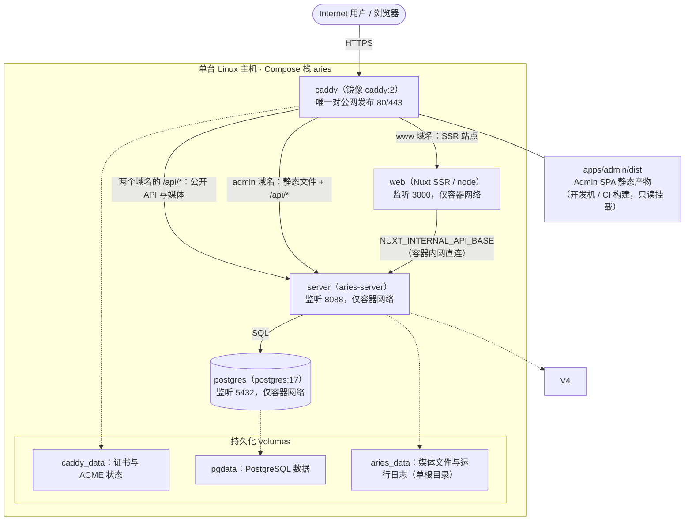

# Docker Compose 生产部署

> 最后验证日期：2026-09-25（对照 `deploy/` 下 Compose、Dockerfile、Caddyfile、`apps/web/nuxt.config.ts`、`apps/admin/src/composables/use-public-site-url.ts`、`.env.example`、`backend/server/src/config.rs` 与 `logging.rs` 核对；原 `deployment.md` 已于本日期并入本文，环境变量与安全项以本文为唯一权威来源）

**回答什么问题**：如何用 `deploy/` 下的 Docker Compose 编排，在一台 Linux 主机上从零部署完整生产环境——**要做的事按什么顺序做、每一步怎么做**；三个产物（Server 镜像、Web 镜像、Admin 静态文件）分别怎么构建——全部产物构建期不含任何域名，镜像一次构建、任意域名部署；`.env` 每个变量的含义、约束与容器内覆盖关系；HTTPS、安全加固、上线验收、备份与回滚。
**写给谁**：部署与运维人员。所有步骤可直接照做；环境变量的权威来源是 `.env.example` 与各模块的 `from_env` 实现，本文解释含义与取值约束。Bare-metal（Systemd + Nginx）拓扑见 `production-deployment.md`，其环境变量与安全约定与本文一致。

**这篇文档怎么用**：

- **第一次部署**：照「部署任务清单」从上往下打勾即可，不必通读全文，卡在哪一步再看对应小节；
- **日常更新代码**：直接去「更新与回滚」，一条命令；
- **线上出问题了**：翻「故障排查」速查表，按症状找排查方向；
- **想搞懂原理**：「部署形态」和「构建详解」解释了这套架构为什么这样设计。

## 目录

- [部署任务清单](#部署任务清单)
- [部署形态](#部署形态)
- [前置准备](#前置准备)
- [构建详解](#构建详解)
- [环境变量配置（`.env`）](#环境变量配置env)
- [参数说明](#参数说明)
- [自动化脚本（`deploy/scripts/`）](#自动化脚本deployscripts)
- [首次部署](#首次部署)
- [HTTPS 与域名](#https-与域名)
- [安全加固](#安全加固)
- [上线验收清单](#上线验收清单)
- [备份与恢复](#备份与恢复)
- [更新与回滚](#更新与回滚)
- [故障排查](#故障排查)
- [改用 Nginx 反代](#改用-nginx-反代)

## 部署任务清单

第一次部署不用慌，按下面九步从上往下做，做完一步勾一步（括号里是该步骤的细节所在小节；第 5 步起有脚本自动代劳）。日常更新代码则跳过清单，直接看「更新与回滚」。

- [ ] **1. 主机与网络**：Linux + Docker Engine/Compose Plugin，构建期内存 ≥ 4 GB，磁盘 ≥ 10 GB，80/443 端口对公网开放（[前置准备](#前置准备)）
- [ ] **2. DNS**：`www` 与 `admin` 两个 A 记录解析到主机公网 IP，**先解析再启动**（[前置准备](#前置准备)）
- [ ] **3. 编写 `.env`**：Server 运行时变量 + Compose 插值变量，含强密码与 ≥ 24 字符的 `BOOTSTRAP_SECRET`（[环境变量配置](#环境变量配置env)）
- [ ] **4. 构建并上传 Admin 产物**：`apps/admin/dist` 保持仓库相对路径上传到主机（[构建详解](#构建详解)）
- [ ] **5. 启动全栈**：`deploy/scripts/deploy.sh --build-admin`，等待四服务就绪（[自动化脚本](#自动化脚本deployscripts)）
- [ ] **6. 创建首个 Owner**：`BOOTSTRAP_SECRET` 调 bootstrap 接口（[首次部署](#首次部署)）
- [ ] **7. Smoke Test 与上线验收**：按[上线验收清单](#上线验收清单)逐项打勾
- [ ] **8. 配置每日备份 cron**：数据库 + 媒体 Volume，归档异地复制（[备份与恢复](#备份与恢复)）
- [ ] **9. 观察期后开启 HSTS**：全站 HTTPS 稳定运行一段时间再开（[安全加固](#安全加固)）

> 时间预算：首次部署大约需要「镜像拉取几分钟 + Rust 全量编译 10–40 分钟（仅首次）+ Nuxt 构建 2–5 分钟」，进度过半时你在等的几乎一定是 Rust 编译，属正常现象。

## 部署形态



要点：

- **只有 Caddy 发布端口**（80/443 映射到宿主机），`server`、`web`、`postgres` 仅存在于 Compose 内部网络，公网无法直连——数据库不暴露是最重要的一层防护。
- **Admin 没有容器**：它是纯静态文件，构建后由 Caddy 从只读 Volume 直接服务；API 请求同源转发到 `server`，因此 `VITE_API_BASE_URL` 留空即可，也不用为 Admin 配额外的 CORS Origin。
- **镜像与域名完全解耦**：`web` 容器内 SSR 经 `NUXT_INTERNAL_API_BASE`（容器内网地址，`docker-compose.yml` 内置）直连 `server`，浏览器端请求固定走**同源** `/api`（由 Caddy 转发）——换域名只改 DNS 与 Caddyfile，不重建任何镜像。所有需要公网绝对地址的场景（Canonical/OG/Sitemap）优先取站点设置里的 `site_url`（Admin 后台可改），其次 `NUXT_PUBLIC_SITE_URL` 环境变量，最后回退请求来源。
- Compose 项目名 `aries`，所有资源带前缀（容器 `aries-server-1`、Volume `aries_pgdata` 等）；`docker compose` 命令必须始终带 `-f deploy/docker-compose.yml`，否则会找不到。

## 前置准备

### 主机要求

- Linux + Docker Engine 与 Compose Plugin（`docker compose version` 可执行）。
- 内存：运行时三容器约 500 MB 以内；但 **Rust 全量编译建议 ≥ 4 GB**（链接阶段吃内存），内存不足会 `cargo` 被 OOM Kill 或链接失败。
- 磁盘：镜像与 Volume 建议预留 ≥ 10 GB（构建缓存 + `pgdata` + 媒体文件增长）。
- 80/443 端口未被其他服务占用，且对公网开放（Caddy 签证书用）。
- 构建工具链无需预装：Rust 直接使用 `rust:bookworm` 镜像预装的 latest stable（仓库不带 `rust-toolchain.toml`，避免 rustup 按别名重复下载工具链卡住构建），pnpm 版本由根 `packageManager` 字段锁定在多阶段构建内自给。本地开发环境要求（Rust ≥ 1.85、Node.js 24+）见根 `README.md`。

### DNS（先解析，再启动）

| 记录                    | 指向        | 用途                  |
| ----------------------- | ----------- | --------------------- |
| `www.example.com` A   | 主机公网 IP | 公开站（Nuxt SSR）    |
| `admin.example.com` A | 主机公网 IP | Admin SPA + Admin API |

Caddy 首次收到请求时才发起 ACME 申请；DNS 未解析或 80 端口不可达会导致反复重试直至触发 Let's Encrypt 速率限制，所以务必先解析好。

## 构建详解

栈里有三个产物，构建方式各不相同，先总览：

| 产物            | 在哪构建                              | 方式                                                              | 构建期固化变量             | 运行时变量                                                       |
| --------------- | ------------------------------------- | ----------------------------------------------------------------- | -------------------------- | ---------------------------------------------------------------- |
| `server` 镜像 | 任意装 Docker 的主机（含生产机）      | `deploy/server.Dockerfile` 多阶段（Rust 编译 → slim 运行时）   | 无（环境变量全部运行期注入） | `env_file` 的全部 Server 变量                                    |
| `web` 镜像    | 同上                                  | `deploy/web.Dockerfile` 多阶段（pnpm 构建 Nuxt → node 运行时） | **无**（域名相关配置全部运行期注入，见下） | `NITRO_HOST` / `NITRO_PORT` / `NUXT_INTERNAL_API_BASE` |
| Admin 静态产物  | 开发机或 CI（**不进 Compose**） | `pnpm --filter @aries/admin build`                              | 无（唯一可选的 `VITE_API_BASE_URL` 仅在 API 非同源部署时需要） | 无（纯静态）                                                     |

**核心规则**：这套架构里**没有任何域名参数在构建期固化**，镜像构建一次可以给别人用、可以任意换域名。原理：

- 浏览器端请求一律走**同源** `/api`（Caddy 按域名转发到 `server`），不需要知道任何域名；
- `web` 容器内的服务端渲染（SSR 与 sitemap/rss 等 Server Route）经私有 Runtime Config `internalApiBase` 直连 `server`，由 Compose `environment:` 在**运行期**注入——私有段不会内联进客户端 Bundle；
- 需要公网绝对地址的 SEO 场景（Canonical/OG/Sitemap）从**站点设置 `site_url`**（数据库存储，Admin 后台可改）或运行期环境变量 `NUXT_PUBLIC_SITE_URL` 读取；
- Admin 的「打开公开站」入口同样运行期从站点设置读取（`apps/admin/src/composables/use-public-site-url.ts`）。

### Server 镜像：`deploy/server.Dockerfile`

两阶段构建：

1. **Builder 阶段**（`rust:bookworm`）：
   - 构建上下文是**仓库根**（`docker-compose.yml` 中 `build.context: ..`），`COPY . .` 把整个 Workspace（`backend/`、`migrations/`、`Cargo.toml`、`Cargo.lock` 等）拷进镜像——`migrations/` 必须在内，因为 Server 启动时要执行 SQLx Migration。
   - Rust 工具链使用镜像预装的 latest stable（不设 `rust-toolchain.toml`：channel=stable 会被 rustup 当成别名再下载一遍，国内网络下构建会卡在 Downloading components）。
   - `cargo build --release -p aries-server` 只编译 Server 及其依赖（不含 migrator），产物约几十 MB 的二进制。
2. **运行时阶段**（`debian:bookworm-slim`）：
   - 只安装 `ca-certificates`：Server 运行期有出站 HTTPS 需求（AI Provider SSE、SMTP、旧图床媒体下载），slim 镜像默认没有 CA 根证书，缺了会导致一切 TLS 出站失败。
   - 采用 postgres / mysql 官方镜像同款的降权模式：容器以 root 启动 `docker-entrypoint.sh`（`deploy/docker-entrypoint.sh`），修复 `/var/lib/aries` 属主后经 `gosu` 降权到非 root 用户 `aries`（uid 10001）运行——bind mount / named volume 都无需手工处理属主，运行态进程被攻破也拿不到 root；`docker run --user` 显式指定用户时自动跳过修复直接执行。
   - 预创建 `/var/lib/aries/media` 与 `/var/lib/aries/logs` 并 `chown` 给 `aries`——所有运行时数据收在单根目录 `/var/lib/aries` 下，Compose 只需挂一个 `aries_data` Volume（named volume 首次挂载继承镜像内目录属主，天然解决非 root 写权限）。
   - `COPY --from=builder` 只带二进制，不带 Toolchain 与源码，最终镜像约 100 MB 级。
   - 镜像内置 `ENV` 默认值 `MEDIA_LOCAL_DIR=/var/lib/aries/media`、`LOG_DIR=/var/lib/aries/logs`（对应预建子目录）：独立 `docker run` 不加任何环境变量也能直接启动；Compose 的 `environment:` 同名键优先，覆盖行为不变。相对路径默认值（如 `./logs`）在容器内基于 `WORKDIR /var/lib/aries` 解析，非 root 用户可写。

### Web 镜像：`deploy/web.Dockerfile`

1. **Builder 阶段**（`node:24-bookworm-slim`）：
   - `corepack enable && corepack prepare pnpm@11.9.0 --activate`：激活的 pnpm 版本与根 `package.json` 的 `packageManager: pnpm@11.9.0` 一致，不用在镜像里全局装 Node 包管理器。
   - `COPY . .` 同样以仓库根为上下文；`pnpm install --frozen-lockfile` 要求 `pnpm-lock.yaml` 与 `package.json` 严格同步——**lockfile 必须提交 Git**，否则 CI/干净环境构建失败。
   - **无构建参数**：`apps/web/nuxt.config.ts` 中后端地址属于私有 Runtime Config（`internalApiBase`，默认 `http://localhost:8088/api/public` 仅供本地开发），运行期由环境变量 `NUXT_INTERNAL_API_BASE` 覆盖（Nuxt 对 `runtimeConfig` 的内建机制），Compose 已注入容器内网地址 `http://server:8088/api/public`。
2. **运行时阶段**（`node:24-alpine`）：只 `COPY --from=builder /build/apps/web/.output`，即 Nitro 服务端产物；`node .output/server/index.mjs` 直接起 SSR Server。选 Alpine 而非 `bookworm-slim`：`.output` 为纯 JS（无原生模块），musl 版 Node 可安全运行，镜像从 ~335 MB 降到 ~247 MB（底座 241 MB 已是官方 Node 镜像的下限）。`NITRO_HOST=0.0.0.0` 必须在容器内监听全部网卡（Compose `environment:` 已内置），监听 `127.0.0.1` 会导致 Caddy 连接被拒。

### Admin 静态产物（不进 Compose）

Admin 是纯 SPA，没有服务器进程，Caddy 直接从只读挂载的 `apps/admin/dist` 提供文件。产物**不含任何域名**：「打开公开站」入口在运行期从站点设置 `site_url` 读取（`use-public-site-url.ts`，未配置时隐藏入口），换域名只需在 Admin「站点设置」里改 `site_url`，无需重新构建。每个部署方在开发机或 CI 上构建后，把 `apps/admin/dist` 上传到主机仓库目录（保持 `apps/admin/dist` 相对路径不变，Caddy 挂载的就是这个路径）。

```bash
# 在仓库根执行；无参数、无域名变量
pnpm --filter @aries/admin build
```

唯一例外：如果 API 与 Admin **不同源**部署（不走 Caddy 同源转发），才需要设置 `VITE_API_BASE_URL`（写入 `apps/admin/.env`，已 Git 忽略，模板见 `apps/admin/.env.example`）：

```bash
deploy/scripts/build-admin.sh --api-base https://api.example.com
```

构建脚本实际是 `vue-tsc -b && vite build`（先全量类型检查再打包），类型错误会阻断产物生成。

### 构建注意要点汇总

- **`.dockerignore` 必须存在**：两个 Dockerfile 都是 `COPY . .` 以仓库根为上下文，当前推荐配置如下（已包含在仓库根 `.dockerignore`）。没有它，`target/`、`node_modules/`、`.git/`、本地产物会被全部拷进 Build Context：首次构建多花几分钟到十几分钟，且主机上编译过的 `target/` 可能干扰镜像内 cargo 缓存判断。

  ```gitignore
  .git
  .github
  .idea
  .vscode
  .codegraph
  **/node_modules
  **/target
  **/.nuxt
  **/.output
  **/coverage
  data
  logs
  runs
  apps/admin/dist
  **/.env
  **/.env.*
  **/.DS_Store
  **/Thumbs.db
  docs
  tests
  **/*.log
  ```

  两个要点：① **Docker 的裸模式（如 `node_modules`）只匹配上下文根目录的同名项，不匹配子目录**（与 `.gitignore` 不同，已在本机实测），目录类排除必须写成 `**/node_modules` 这种显式形式；② `migrations/`、`Cargo.lock`、`pnpm-lock.yaml`、`package.json`、`pnpm-workspace.yaml` **不能**被忽略（Server 启动与可复现构建依赖它们）。
- **层缓存与更新构建**：`git pull` 后 `up -d --build`，`COPY . .` 之后的层在源码变化时必然重建，但 Rust 的依赖编译与 Nuxt 的 `pnpm install` 无单独缓存层——依赖没变也会重跑。想加速可在 Dockerfile 中先把 `Cargo.toml`/`Cargo.lock` 或 `pnpm-lock.yaml` 拷入做依赖层（当前未做，属已知取舍）。
- **Migrator 不在任何镜像里**：数据迁移工具 `aries-migrator` 是独立二进制，在开发机/CI 针对目标库运行（见 `migration-runbook.md`），不要试图在 `server` 容器里跑迁移；其专用环境变量见下文「迁移工具」表。
- **国内构建加速**：两个 Dockerfile 均内置可选开关 `--build-arg USE_CN_MIRROR=1`——`server.Dockerfile` 切换 crates sparse 索引到 rsproxy 与 Debian 软件源到 USTC，`web.Dockerfile` 切换 corepack 下载源与 npm registry 到 npmmirror；不传该参数则保持官方源，行为不变（生产/CI 构建不受影响）。
- **版本一致性**：Rust 使用 `rust:bookworm` 镜像的 latest stable（与 CI 一致），pnpm 版本由根 `packageManager` 字段锁定，构建机无需预装对应工具链；但本地 `pnpm install` 升级过依赖就必须提交 lockfile，否则 `--frozen-lockfile` 构建失败。

## 环境变量配置（`.env`）

`.env` 一份两用：被 `server` 容器经 `env_file` 读取（全部 Server 运行时变量），同时被 Compose 用于 `${...}` 插值（`postgres` 密码）。开发默认值见 `.env.example`；**系统环境变量优先于 `.env` 文件**。生产最小可用示例（占位符替换为真实值，**不要提交 Git**，文件权限建议 `600`）：

```bash
# ===== Server 运行时（env_file → server 容器）=====
APP_ENV=production
BOOTSTRAP_SECRET=<至少 24 字符的随机串，仅用于创建首个 Owner>
ADMIN_ORIGINS=https://admin.example.com
SESSION_TTL_HOURS=12
SESSION_COOKIE_SECURE=true            # 要求 Admin 只走 HTTPS，配好证书前别急着开
DATABASE_HOST=postgres                # 容器网络内主机名；本项也可删掉，Compose 已强制覆盖
DATABASE_PORT=5432
DATABASE_USERNAME=aries
DATABASE_PASSWORD=<随机强密码>
DATABASE_NAME=aries
DATABASE_SCHEMA=public
LOG_RETENTION_DAYS=14
LOG_SQL=false
MEDIA_PROVIDER=local
MEDIA_LOCAL_DIR=/var/lib/aries/media  # 镜像内置默认值，一般无需在 .env 出现；此处仅为可读性
MEDIA_PUBLIC_BASE_URL=/api/media/files
# 可选：站点设置 site_url 未配置时，SEO 绝对地址的兜底（不设置则回退请求来源）
# NUXT_PUBLIC_SITE_URL=https://www.example.com
# S3_* 仅在 MEDIA_PROVIDER=s3 时需要
# AI / SMTP 集成不是环境变量：部署后在 Admin 设置分组（email / ai）中配置，存于数据库 setting_groups 表

# ===== Compose 插值（编排期消费，server 容器读不到这里）=====
# DATABASE_PASSWORD 同时被下方 postgres 服务插值，必须与上面 server 用的值一致
```

### 变量语义

**服务与认证**

| 变量 | 默认值 | 约束与说明 |
| --- | --- | --- |
| `APP_ENV` | `development` | `production` 时控制台日志切为 JSON，`SESSION_COOKIE_SECURE` 默认改为 `true` |
| `SERVER_ADDR` | `0.0.0.0:8088` | 监听地址，必须是合法的 `host:port`；容器内必须 `0.0.0.0`（Compose 已覆盖） |
| `ADMIN_ORIGINS` | `http://127.0.0.1:5173,http://localhost:5173` | 逗号分隔的精确 Origin 白名单；每项只能包含 Scheme 与 Authority，不允许 Path、Query；至少一项；生产必须含 `https://admin.example.com`；兼容别名 `ADMIN_ORIGIN` |
| `BOOTSTRAP_SECRET` | 无（**必填**） | 少于 24 字符时启动失败；只通过 Secret Manager 或部署环境注入，不写入 Image、Repository 或部署日志 |
| `SESSION_TTL_HOURS` | `12` | 整数，允许 1–720 |
| `SESSION_COOKIE_SECURE` | `production` 为 `true`，否则 `false` | 只接受 `true` / `false` / `1` / `0`；`true` 要求 Admin 只通过 HTTPS 访问 |
| `RUST_LOG` | `info,tower_http=info,sqlx::query=off` | 标准 `tracing` Filter，最终覆盖入口 |

> **警告**：`SESSION_COOKIE_SECURE=true` 要求 Admin 只通过 HTTPS 访问。若站点尚未全站 HTTPS，浏览器会拒绝携带该 Cookie 导致无法登录；但生产环境绝不应为了「能登录」而将其设为 `false`——正确做法是先配好 HTTPS，再开启此项（见 [HTTPS 与域名](#https-与域名)）。

**数据库**

| 变量 | 默认值 | 约束与说明 |
| --- | --- | --- |
| `DATABASE_HOST` / `DATABASE_USERNAME` / `DATABASE_PASSWORD` / `DATABASE_NAME` | 无 | 四个变量任一出现即启用结构化配置，此时四个全部必填 |
| `DATABASE_PORT` | `5432` | 仅结构化配置使用；`.env.example` 的本地默认值为 `5433` |
| `DATABASE_URL` | 无 | 结构化配置缺位时的替代方式，完整 PostgreSQL 连接串 |
| `DATABASE_SCHEMA` | `public` | 只接受简单 Identifier（字母、数字、下划线），启动时校验 |
| `DATABASE_SLOW_QUERY_MS` | `500` | 非负整数（毫秒）；超过阈值的查询以 WARN 记入运行日志，`0` 关闭 |

数据库运维要点：Backend 启动时自动执行 `CREATE SCHEMA IF NOT EXISTS`（`DATABASE_SCHEMA`）并运行 `migrations/` 下未执行的 SQLx Migration，**所有结构变更只通过新增 Migration 文件完成，禁止运行时或手工改表**。本拓扑中 `postgres` 容器由首个 Migration 自动创建 `citext` 扩展；改用外部实例时需预装（`CREATE EXTENSION IF NOT EXISTS citext WITH SCHEMA public`）并确保业务账号有权创建扩展。

**媒体存储**

| 变量 | 默认值 | 约束与说明 |
| --- | --- | --- |
| `MEDIA_PROVIDER` | `local` | 只接受 `local` 或 `s3` |
| `MEDIA_LOCAL_DIR` | `./data/media` | `local` 模式的上传落盘目录；容器内为 `/var/lib/aries/media`（`aries_data` Volume 的子目录，必须持久化并进备份） |
| `MEDIA_PUBLIC_BASE_URL` | `/api/media/files` | 公开 URL 前缀，必须以 `/` 或 `http` 开头；`local` 模式由 Backend 的 `/api/media/files/*path` 路由直接提供文件（经 Caddy 同源转发） |
| `S3_ENDPOINT` / `S3_BUCKET` / `S3_ACCESS_KEY` / `S3_SECRET_KEY` / `S3_PUBLIC_BASE_URL` | 无 | `MEDIA_PROVIDER=s3` 时全部必填；Path Style 寻址，兼容 MinIO / R2 |
| `S3_REGION` | `us-east-1` | 仅 `s3` 模式使用 |

媒体存储要点：`local` 写盘由 `/api/media/files/*path` 匿名路由提供访问；`s3` 公开访问走 `S3_PUBLIC_BASE_URL`（通常是 CDN 或 Bucket 公开域名），且 `MEDIA_PUBLIC_BASE_URL` 必须与存储后端的公开 Base URL 一致，否则正文引用解析会出错。删除为软删除，物理清理由后台任务 `media_cleanup` 在零引用后执行；切换 Provider 不会自动搬迁历史文件。

**日志**

| 变量 | 默认值 | 约束与说明 |
| --- | --- | --- |
| `LOG_DIR` | `./logs` | 日志文件目录；容器内为 `/var/lib/aries/logs`（`aries_data` Volume 的子目录） |
| `LOG_RETENTION_DAYS` | `14` | 正整数，超出天数的日志文件由进程自动清理 |
| `LOG_SQL` | 未设置时：`production` 为 `false`，其余环境为 `true` | 只接受 `true` / `false` / `1` / `0`；`true` 时记录每条 SQL 语句（DEBUG 级）；仅为启动初始值，运行期可在 Admin「系统 → 运行日志」页切换，无需重启 |

日志要点：双输出——控制台（开发期 Pretty，`APP_ENV=production` 时 JSON）与文件（始终 JSON，每行一条含 `timestamp` / `level` / `target` / `message`，按天切分为 `aries-server.YYYY-MM-DD`，超期自动清理）。每条 HTTP 请求记录 `method` / `path` / `request_id` / `status` / `latency_ms`，排查跨请求问题用 `request_id` 串联（Response 回传 `x-request-id` Header）。`LOG_SQL=true` 仅用于临时排查，SQL 文本可能包含业务数据，排查完务必关回 `false`。日志文件不包含 Password、Session Token、Bootstrap Secret。

**迁移工具（仅 `aries-migrator` 使用，生产 Server 不读）**

| 变量 | 说明 |
| --- | --- |
| `MIGRATION_MYSQL_URL` | 旧版 MySQL 连接串（只读），仅在数据迁移时配置 |
| `MIGRATION_POSTGRES_URL` | 目标 PostgreSQL 连接串，仅在数据迁移时配置 |

### Compose 插值与消费方

| 变量                                                                                                                                           | 谁消费                                         | 说明                                                                                                        |
| ---------------------------------------------------------------------------------------------------------------------------------------------- | ---------------------------------------------- | ----------------------------------------------------------------------------------------------------------- |
| `APP_ENV`、`BOOTSTRAP_SECRET`、`ADMIN_ORIGINS`、`DATABASE_*`、`MEDIA_*`、`LOG_*`、`SESSION_*`、`S3_*` 等上表全部 | `server` 容器（`env_file: ../.env`）       | 改动后 `up -d server` 重建生效                                                                            |
| `DATABASE_PASSWORD`                                                                                                                          | Compose 插值 →`postgres` 服务               | 必须**同时**等于 `.env` 中 `DATABASE_PASSWORD`（server 用它连库）——两处不一致 server 会连不上库 |
| `NUXT_PUBLIC_SITE_URL`（可选）                                                                                                               | `web` 容器（运行期环境变量）             | SEO 绝对地址兜底，优先站点设置 `site_url`；改后 `up -d web` 生效，无需重建镜像                        |
| `VITE_API_BASE_URL`（可选）                                                                                                                  | Admin 构建机（**构建期**，不经 Compose） | 仅 API 与 Admin 不同源部署时需要；写入 `apps/admin/.env`（见「构建详解」）                            |

注意：**不再有 `NUXT_PUBLIC_API_BASE`**。web 容器的后端地址由 Compose `environment:` 内置（`NUXT_INTERNAL_API_BASE=http://server:8088/api/public`），连 `.env` 都不需要出现。

两个容易踩的坑：

- **`--env-file .env` 不能省**：`-f deploy/docker-compose.yml` 时 Compose 的默认 `.env` 查找目录是 `deploy/` 而不是仓库根，不带 `--env-file` 会在 `up` 时直接报 `DATABASE_PASSWORD ... 设置`。
- **容器覆盖项**（Compose 的 `environment:` 会覆盖 `env_file` 同名值，已内置，无需改也别在 `.env` 里写冲突值）：

  | 变量                                  | 容器内生效值                                       | 为什么必须覆盖                                           |
  | ------------------------------------- | -------------------------------------------------- | -------------------------------------------------------- |
  | `DATABASE_HOST` / `DATABASE_PORT` | `postgres` / `5432`                              | `.env` 本地开发默认是 `localhost:5433`，容器内指本机 |
  | `SERVER_ADDR`                       | `0.0.0.0:8088`                                   | 容器内必须监听全部网卡才能被 Caddy 访问                  |
  | `NUXT_INTERNAL_API_BASE`          | `http://server:8088/api/public`                | web 容器 SSR 直连后端的容器内网地址                      |

  数据目录不再需要覆盖：`MEDIA_LOCAL_DIR` / `LOG_DIR` 的合理默认值已直接内置在 `server` 镜像（`/var/lib/aries/{media,logs}`），配合单一 `aries_data` Volume 挂载即完成持久化。

## 参数说明

本地用预先 build 好的镜像做部署测试时，不要改动本文件的**服务名**（Caddyfile、`deploy.sh`、`backup.sh` 都依赖 `server` / `web` / `postgres` 命名）：用 override 文件 `deploy/docker-compose.local.yml`（把 build 换成 image），命令为 `docker compose -f deploy/docker-compose.yml -f deploy/docker-compose.local.yml --env-file .env up -d`。

### `docker-compose.yml` 逐服务解释

**`caddy`（唯一对公网暴露的服务）**

| 配置                            | 取值                                    | 说明                                                               |
| ------------------------------- | --------------------------------------- | ------------------------------------------------------------------ |
| `image`                       | `caddy:2`                             | 官方镜像，无需构建                                                 |
| `ports`                       | `80:80`、`443:443`、`443:443/udp` | HTTP 重定向与 HTTPS；UDP 443 是 HTTP/3，可去掉                     |
| `volumes: Caddyfile`          | 只读挂载                                | 反代与站点定义，改后需`caddy reload`（见下文）                   |
| `volumes: ../apps/admin/dist` | 只读挂载到`/srv/admin`                | Admin SPA 静态文件                                                 |
| `volumes: caddy_data`         | `/data`                               | **证书与 ACME 账户状态**，删了会重新申请（触发速率限制风险） |
| `depends_on`                  | `server`、`web`                     | 仅启动顺序，不做健康等待（反代对后端宕机有内置重试）               |

**`server`（aries-server）**

| 配置                                                             | 取值                 | 说明                                                                                                            |
| ---------------------------------------------------------------- | -------------------- | --------------------------------------------------------------------------------------------------------------- |
| `build.context: ..` + `dockerfile: deploy/server.Dockerfile` | 以仓库根为构建上下文 | Dockerfile 在`deploy/` 但 `COPY . .` 需要整个 Workspace（含 `backend/`、`migrations/`、`Cargo.toml`） |
| `env_file: ../.env`                                            | 全部 Server 环境变量 | `environment:` 同名键优先                                                                                   |
| `volumes: aries_data`                                          | `/var/lib/aries`     | 单根目录持久化（内含 `media/` 与 `logs/`）；`media/` 必须进备份                                                |
| `depends_on.postgres.condition: service_healthy`               | 等 PG 就绪           | 避免启动竞态导致首次 Migration 失败                                                                             |
| `restart: unless-stopped`                                      | 自动重启             | 主机重启后自动拉起                                                                                              |

**`web`（Nuxt SSR）**

| 配置                                  | 取值                            | 说明                                                                                                    |
| ------------------------------------- | ------------------------------- | ------------------------------------------------------------------------------------------------------- |
| `build`                             | 无 build args（已移除） | 产物不含域名，构建一次任意部署（见「构建详解」）                                                      |
| `environment.NITRO_HOST/PORT`     | `0.0.0.0:3000`                | 必须`0.0.0.0`，容器内监听回环会导致 Caddy 无法连通                                                    |
| `environment.NUXT_INTERNAL_API_BASE` | `http://server:8088/api/public` | SSR 直连后端的容器内网地址（Nuxt 私有 runtimeConfig 运行期覆盖）；浏览器端走 Caddy 同源转发，不经过它 |

**`postgres`**

| 配置                          | 取值                         | 说明                                                   |
| ----------------------------- | ---------------------------- | ------------------------------------------------------ |
| `POSTGRES_USER/PASSWORD/DB` | `aries` / 插值 / `aries` | 该用户即超管，`citext` 扩展由首个 Migration 自动创建 |
| `volumes: pgdata`           | 数据目录                     | **最重要的 Volume**，必须进备份                  |
| `healthcheck`               | `pg_isready` 每 5s ×10    | 通过后`server` 才启动；连续失败 10 次标记 unhealthy  |

### `Caddyfile` 逐段解释

```caddyfile
www.example.com {
    @api path /api/*            # 浏览器端公开 API 与媒体文件（/api/media/files/*）
    handle @api {
        reverse_proxy server:8088   # 同源转发到后端；密码文章解锁的 HttpOnly Cookie 依赖这条链路
    }

    handle {
        reverse_proxy web:3000      # 其余 SSR 站点整体转发给 web 容器（容器名即主机名）
    }
}

admin.example.com {
    root * /srv/admin           # 静态文件根目录（compose 挂载）
    encode zstd gzip            # 响应压缩，省带宽

    @api path /api/*            # 匹配 API 请求
    handle @api {
        reverse_proxy server:8088   # 同源转发到 aries-server；Origin 头默认透传，CSRF 校验不受影响
    }

    handle {                    # 其余全部按 SPA 处理
        try_files {path} /index.html   # 路由不存在时回退 index.html（vue-router 接管）
        file_server
    }
}
```

- `www` 站的 `/api/*` 转发是关键链路：浏览器端代码全部走同源 `/api/public`（与域名无关，镜像因此无需任何构建参数）；`server` 返回的相对媒体 URL（`/api/media/files/...`）也经它服务。
- 改域名：替换两处 `example.com` 后 `caddy reload`（见下节）。
- 生产建议去掉 `443:443/udp` 端口映射并删除 `encode` 之外的探索性改动；HSTS 等加固见「安全加固」一节。

## 自动化脚本（`deploy/scripts/`）

三个脚本覆盖「构建 → 部署 → 备份」全生命周期，均可在任意目录执行（自行定位仓库根）、`set -euo pipefail` 严格模式、前置条件缺失即非零退出。需要 bash：Windows 开发机可用 Git Bash 跑 `build-admin.sh`；`deploy.sh` 与 `backup.sh` 应在目标 Docker 主机上运行。

### `build-admin.sh`：构建 Admin 静态产物

```bash
deploy/scripts/build-admin.sh
```

- 无参数、无域名变量：「打开公开站」入口运行期从站点设置 `site_url` 读取，构建产物与域名无关。
- `--api-base`：仅在 API 与 Admin 不同源部署时传入（写入 `apps/admin/.env` 的 `VITE_API_BASE_URL`，该文件已 Git 忽略）；缺省空串走同源 `/api/admin`。
- 产物为 `apps/admin/dist`，部署时保持相对路径上传到主机仓库目录。

### `deploy.sh`：一键部署

```bash
# 首次部署：环境检查 → 构建 Admin → up -d --build → 等待就绪
deploy/scripts/deploy.sh --build-admin

# 日常更新（git pull 之后）
deploy/scripts/deploy.sh

# 只重建部分服务（-- 之后原样传给 compose up）
deploy/scripts/deploy.sh -- server web
```

- 前置检查：`.env` 存在且 `DATABASE_PASSWORD` / `BOOTSTRAP_SECRET` / `ADMIN_ORIGINS` 非空；`apps/admin/dist` 缺失只警告不阻断（可后续补传）。
- 就绪等待：`postgres` healthy、`server` / `web` / `caddy` running；超时（`--timeout`，默认 300s）打印对应服务最近日志并非零退出。
- 结束后打印 `compose ps` 与基于 `ADMIN_ORIGINS` 推导的探活命令。

### `backup.sh`：每日备份

```bash
# 手动执行：备份到 ./backups，保留 14 天
deploy/scripts/backup.sh

# cron（每天 03:00）
0 3 * * * cd /opt/aries && deploy/scripts/backup.sh >> logs/backup.log 2>&1

# 自定义备份目录与保留天数
BACKUP_DIR=/var/backups/aries KEEP_DAYS=30 deploy/scripts/backup.sh
```

- 产出 `aries-<时间戳>.dump`（`pg_dump -Fc`）与 `media-<时间戳>.tar.gz`，自动清理 `KEEP_DAYS` 天前的归档。
- 直接用 `docker exec` 而非 compose 命令：compose 文件的 `:?` 插值变量要求 `.env` 完整，备份不该被编排变量卡住；容器名 `aries-postgres-1` 与 Volume 名 `aries_data` 由 compose 的 `name: aries` 固定，可用 `POSTGRES_CONTAINER` / `DATA_VOLUME` 覆盖；媒体从该 Volume 的 `media/` 子目录打包。
- 异地复制不内置，在脚本标记处追加 rclone/rsync；恢复操作见下文「备份与恢复」。

## 首次部署

到这一步，主机、DNS、`.env`、Admin 产物都已就绪。懒人方式是一条命令（自动完成环境检查、构建与就绪等待）：

```bash
deploy/scripts/deploy.sh --build-admin
```

想看清每一步发生了什么，就手动分步执行（在仓库根目录）：

```bash
# 1. 构建并启动（首次含 Rust 全量编译，耐心等）
docker compose -f deploy/docker-compose.yml --env-file .env up -d --build

# 2. 检查状态：caddy/server/web 为 running，postgres 为 running (healthy)
docker compose -f deploy/docker-compose.yml ps

# 3. 经 Caddy 验证 API 链路（live=进程存活，ready=依赖就绪，供监控系统探活）
curl -fsS https://admin.example.com/api/health/ready
```

`server` 首次启动自动完成：创建 Schema → 执行全部 Migration → 开始监听；后台 Worker（媒体清理、元数据探测、session 清理等）随进程启动。

创建首个 Owner（字段以 `docs/openapi.yaml` 为准）：

```bash
curl -fsS -X POST https://admin.example.com/api/admin/auth/bootstrap \
  -H 'Content-Type: application/json' \
  -d '{"bootstrap_secret":"<BOOTSTRAP_SECRET>","login":"admin","password":"<strong-password>","display_name":"Admin"}'
```

成功后用该账号登录 Admin——这是唯一一次「免登录入场券」，已有 User 后 bootstrap 接口永久关闭，请妥善保存账号密码。随后进入[上线验收清单](#上线验收清单)。

## HTTPS 与域名

HTTPS 全自动：Caddy 首次收到请求时为 Caddyfile 中的域名申请 Let's Encrypt 证书，存入 `caddy_data` Volume，此后自动续期。**不要**在宿主机再运行 certbot 等工具，会争抢 80 端口。

常用操作：

```bash
# 改了 Caddyfile（如换域名）后热加载，无需重启容器
docker compose -f deploy/docker-compose.yml exec caddy \
  caddy reload --config /etc/caddy/Caddyfile

# 查看证书状态
docker compose -f deploy/docker-compose.yml exec caddy caddy list-certificates
```

换域名只需要四处同步，**全部运行期完成、无需重建任何镜像**：Caddyfile 两处域名（`caddy reload`）、`.env` 的 `ADMIN_ORIGINS`（`up -d server`）、`site_settings` 里的 `site_url`（Admin 后台「站点设置」修改，Canonical/OG/Sitemap 与 Admin「打开公开站」自动跟随）、DNS 解析。

Reverse Proxy 通用要求（Caddy 默认满足，改用其他 Proxy 时逐项确认）：

- `/api/*` 转发到 `aries-server:8088`；Admin 静态文件与 API 使用同一站点（本拓扑即 `admin.example.com`），避免额外 Origin 配置。
- 保留浏览器发送的 `Origin` Header，不由 Proxy 覆盖或伪造——Admin 写请求的 CSRF 防线依赖它（Caddy 默认透传）。
- HTTPS Termination 后将 HTTP 自动重定向到 HTTPS（Caddy 默认）；HSTS 见「安全加固」。
- 不缓存 `/api/admin/*` 响应（Caddy 默认不缓存）；访问日志不得记录 Cookie、Password、Bootstrap Secret 或 Reset Token。
- Proxy 与 Backend 的 Request Body、Header 和 Timeout Limit 显式配置——上传媒体文件的 Body Limit 不能小于业务上限（`backend/server` 的上传限制见 `docs/openapi.yaml`；Caddy 默认无 Body Limit 收紧，够用）。

## 安全加固

**安全响应头**：Backend 已为所有响应内置以下头，Caddy 无需重复添加（Nuxt 侧另有一致的 `frame-ancestors`/`nosniff` 等）：

- `X-Content-Type-Options: nosniff`
- `X-Frame-Options: DENY`
- `Referrer-Policy: strict-origin-when-cross-origin`
- `Content-Security-Policy`（仅 `frame-ancestors 'none'`，禁止被任意站点 Frame 嵌入）

**HSTS**（可选，全站 HTTPS 稳定运行一段时间后开启）：取消 `deploy/Caddyfile` 底部注释，建议先用 `max-age=300` 验证，确认无 HTTP 资源依赖后再加大。HSTS 一旦下发，浏览器在 `max-age` 内会拒绝该域名的 HTTP 访问，开启前务必确认 HTTPS 配置正确。

**Cookie 与 CSRF**：Session Cookie 名为 `aries_admin_session`，属性为 `HttpOnly`、`SameSite=Lax`、Path 限定 `/api/admin`，`Secure` 由 `SESSION_COOKIE_SECURE` 控制。所有 Admin 写请求（非 GET / HEAD / OPTIONS）校验 `Origin` 必须精确匹配 `ADMIN_ORIGINS` 中的一项（见 `backend/server/src/http/mod.rs` 的 `enforce_origin`）；CORS 使用同一白名单并允许 Credentials。登录会先撤销旧 Session 再签发新 Session；修改密码、重置密码或禁用 User 时撤销该 User 全部 Session。

## 上线验收清单

逐项验证，全部通过后方可正式使用（Bare-metal 部署同样适用）：

1. HTTPS 下登录成功，HTTP 入口被重定向。
2. Cookie 包含 `HttpOnly`、`Secure`、`SameSite=Lax` 和正确 Path（`/api/admin`）。
3. 缺失或错误 `Origin` 的 Admin 写请求返回 `403`。
4. Logout、修改 Password 和 Password Reset 后旧 Session 无法继续使用。
5. `/api/health/live` 与 `/api/health/ready` 在监控系统配置为探活端点。
6. 公开站首页/文章页/分类/标签/归档/搜索正常，文章内媒体可访问；上传一张图片后可经公开 URL 访问，`aries_data` Volume 已持久化且 `media/` 进备份。
7. `aries_data` Volume 持久化，日志按天切分且保留天数符合 `LOG_RETENTION_DAYS` 预期。
8. Production 不公开 Debug Error；`BOOTSTRAP_SECRET` 不出现在任何日志与仓库中。

## 备份与恢复

需要备份的是 `pgdata`（经 `pg_dump` 导出）与 `aries_data` Volume 里的 `media/` 子目录；`caddy_data` 丢了只是重新签证书（有速率限制风险），`logs/` 可舍弃。

**备份**（每日 cron 直接用 `deploy/scripts/backup.sh`，见「自动化脚本」；手工命令等价如下，并记得异地复制归档文件）：

```bash
# 数据库（Custom Format，单文件含 Schema + 数据）
docker compose -f deploy/docker-compose.yml --env-file .env exec -T postgres \
  pg_dump -U aries -Fc aries > "aries-$(date +%F).dump"

# 媒体文件（aries_data Volume 内的 media/ 子目录）
docker run --rm -v aries_data:/data:ro -v "$PWD":/backup alpine \
  sh -c "tar czf /backup/media-$(date +%F).tar.gz -C /data/media ."
```

**恢复**（在新主机或演练环境，假设 Compose 栈已 `up`）：

```bash
# 数据库：--clean 清掉现有对象后重建（会覆盖当前数据，先确认目标环境）
docker compose -f deploy/docker-compose.yml --env-file .env exec -T postgres \
  pg_restore -U aries -d aries --clean --if-exists < aries-2026-09-12.dump

# 媒体：清空 media/ 后解包（logs/ 不动）
docker run --rm -v aries_data:/data -v "$PWD":/backup alpine \
  sh -c "rm -rf /data/media/* && tar xzf /backup/media-2026-09-12.tar.gz -C /data/media"
```

恢复后验证：登录 Admin、抽查文章媒体、公开站渲染正常。备份的有效性以恢复演练为准——每季度至少演练一次。

## 更新与回滚

```bash
git pull
deploy/scripts/deploy.sh        # 等价于下面这条，另含前置检查与就绪等待
# docker compose -f deploy/docker-compose.yml --env-file .env up -d --build
```

- `server` 重建时自动执行新 Migration；`web` 镜像不含域名，`--build web` 只是代码更新，与域名配置无关。
- 分组件更新：只更新后端 `up -d --build server`；只更新公开站 `up -d --build web`；**只更新 Admin 无需重启任何容器**——重新构建并覆盖 `apps/admin/dist` 即生效（Caddy 直读文件），注意清 CDN/浏览器缓存。
- `.env` 改动按消费方生效：Server 变量 `up -d server`（重建容器）；`NUXT_PUBLIC_SITE_URL` 改动 `up -d web` 即可（运行期变量）；`DATABASE_PASSWORD` 改动需同时重建 `server` 与 `postgres`（且 postgres 数据目录已按旧密码初始化过的情况需要额外处理，见故障排查）。
- 回滚约束：Migration 只前进不后退。若新 Migration 已执行后需要回退 Binary，先人工评估新旧代码与 Schema 兼容性（新增列/索引通常安全），不兼容时按 `migration-runbook.md` 手工编写逆向 SQL。**先备份、再升级**是硬前提。

## 故障排查

遇到问题时，先把这两个命令的输出过一遍，大多数症状都能在日志里找到原因：

```bash
docker compose -f deploy/docker-compose.yml ps                 # 谁没起来 / 谁不健康
docker compose -f deploy/docker-compose.yml logs --tail=50 <服务名>   # 它最后说了什么
```

| 症状                                         | 排查方向                                                                                                                                             |
| -------------------------------------------- | ---------------------------------------------------------------------------------------------------------------------------------------------------- |
| `up` 报 `DATABASE_PASSWORD ... 设置`     | `.env` 缺插值变量，或 `--env-file` 未传（`-f deploy/...` 时 Compose 默认去 `deploy/` 找 `.env`）                                           |
| `postgres` 一直 `starting`/`unhealthy` | `docker compose logs postgres`，多为数据目录权限或内存不足                                                                                         |
| `server` 反复重启                          | `docker compose logs server`：连不上库（检查 `DATABASE_PASSWORD` 与 postgres 服务是否一致）、`BOOTSTRAP_SECRET` 短于 24 字符、Migration 报错   |
| 改了 `.env` 的 Server 变量不生效            | 变量是容器创建时注入的，`up -d`（不带 `--build`）只会重建配置有变化的容器；确认 `docker compose ps` 后必要时 `up -d --force-recreate server` |
| 公开站 SSR 500、服务端取数失败             | `docker compose logs web`；多为 `NUXT_INTERNAL_API_BASE` 不通（容器网络内 `server:8088` 不可达，检查服务名与端口映射）                         |
| 浏览器端公开 API 404 / 媒体打不开          | 检查 Caddyfile 中 `www` 站的 `/api/*` 转发是否存在并 `caddy reload`                                                                                |
| 浏览器访问域名提示证书错误/超时              | DNS 未指向本机、80/443 被防火墙拦截、宿主机已有服务占用端口（`ss -tlnp`）                                                                          |
| ACME 反复失败「rate limit」                  | 在 DNS/端口修复前反复重试所致，等限速窗口（一般 1 小时）或先用 staging 环境调试                                                                      |
| Admin 登录 403 / CORS 报错                   | `ADMIN_ORIGINS` 未含 `https://admin.example.com`（精确匹配，注意 https 与无尾斜杠），改后 `up -d server`                                       |
| 出站 HTTPS 请求全部失败（AI/邮件）           | 运行时镜像缺 CA 证书——确认构建自未改动的 `deploy/server.Dockerfile`（`ca-certificates` 安装步骤不能被删掉）                                     |
| 媒体上传成功但访问 404                       | `media` Volume 未持久化（检查 compose 中挂载是否被删掉重建）                                                                                       |
| 改 Caddyfile 不生效                          | 需 `caddy reload`（见 HTTPS 一节），不是重启 Caddy 容器                                                                                             |

## 改用 Nginx 反代

将 `docker-compose.yml` 中的 `caddy` 服务整体替换为官方 `nginx` 镜像：挂载自行维护的 Nginx 配置（Server Block 写法参考 `production-deployment.md` 的「Nginx 与 HTTPS」一节，`proxy_pass` 目标改为容器名 `web:3000` 与 `server:8088`，两个 Server Block 都要配 `/api/` 前缀转发），证书改用 certbot 管理并挂载进容器。其余服务定义不变。代价是失去自动签证书能力，换来配置的最高可控性。
